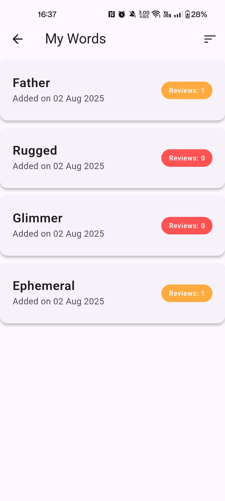

<p align="center">
  
</p>

# Vocaber

*Stop guessing. Start learning, one word at a time.*

---

## 🚀 Overview

Vocaber is a fast, science-based vocabulary trainer.
- **No accounts, no ads, no tracking.**

<p align="center">
  <a href="https://play.google.com/store/apps/details?id=your.package.name">
    
  </a>
  
</p>

---

## ✨ Features

- 🔍 **Instant Definitions:** Search for words and get definitions in multiple languages.
- ⏰ **Spaced Repetition:** Review your words at optimal intervals, making your learning more efficient.
- 📊 **Progress Tracking:** See your streak, XP, and review stats.
- 🖼️ **Custom Profile:** Personalize your username and avatar.
- 📤 **Export/Import:** Backup or transfer your vocabulary with one tap.
- 🌙 **Offline-first:** Works without internet for reviewing and managing your words.
- 🧩 **Multi-language Support:** Currently supports **English** and **French**.

---

## 🖼️ Screenshots

  
  
  
  
  
  
  
</p>

---

## 📥 Build from source

If you want bleeding edge features, you can build Vocaber from source:

```sh
git clone https://github.com/yourusername/vocaber.git
cd vocaber
flutter pub get
flutter run
```

---

## 🛠️ Tech Stack

- **Flutter** (cross-platform mobile)
- **Hive** (local database)
- **image_picker, cached_network_image, fl_chart** (media & charts)
- **Intl** (Multiple language support)

---

## 🌍 Language Support

Vocaber is designed to be extensible for multiple languages.
Currently, **English** and **French** are supported.
If you'd like to help add support for your language, see the [Contributing](#-contributing) section!

---

## 🤝 Contributing

Contributions are welcome! I am by no means a UI/UX expert nor a professional mobile developer.

**How to add a new display language:**
1. Copy `intl_en.arb` to `intl_xx.arb` (where `xx` is your language code).
2. Translate all values.
3. Add your language to `supportedLocales` in `main.dart`.
4. Submit your PR!

**How to add a vocabulary language:**
1. Create a scraper from your favorite dictionary in `models/scrapers` that extends the **Scraper** class.
2. Add a case in `fromTerm` method of the **Word** class.
3. Submit your PR!

---

## 📄 License

Vocaber is licensed under the [GNU GPL v3.0](https://www.gnu.org/licenses/gpl-3.0.html).
